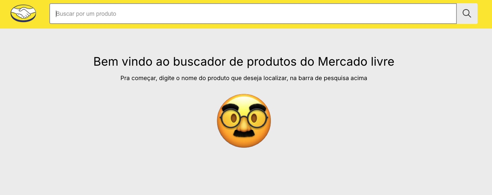

# Aplicação de Pesquisa de Produtos

Bem-vindo ao repositório da aplicação de pesquisa de produtos.



## 👀 Visão Geral

Esta aplicação web é composta por três componentes principais que trabalham juntos para fornecer uma experiência completa de busca e visualização de produtos:

1. **Caixa de Pesquisa**
2. **Exibição dos Resultados**
3. **Descrição Detalhada do Produto**

Os dados utilizados para cada um dos componentes acima foi obtido da [API pública do Mercado Livre](https://developers.mercadolivre.com.br/pt_br/itens-e-buscas).

_Obs.: Alguns detalhes das especificações foram adaptados para melhorar o resultado_

## 🏗️ Estrutura do Projeto

Estruturamos a aplicação utilizando [npm workspaces](https://docs.npmjs.com/cli/v7/using-npm/workspaces) para orquestrar os 3 módulos principais:

### 📄 API


Camada intermediária entre o front-end e a API original. Aqui, utilizamos o express para construção dos endpoints e optamos por uma arquitetura próxima aos padrões do Clean Architecture.

```
/application            # [Lógicas principais]
  /controllers          # Lógica dos endpoints do BFF
  /services             # Lógica dos serviços externos (requisições para API Pública)

/domain                 # [Regras de negócio]
  /entities             # Construtores de entidades do BFF
  /repositories         # Interfaces dos serviços externos

/infrastructure         # [Comunicação com serviços externos]
  ApiService.ts         # Abstração do axios

/utils                  # [Utilitários gerais]
```

Para criar o setup inicial, utilizamos a ferramenta de linha de comando [express-generator](https://expressjs.com/en/starter/generator.html).

Nos testes, estamos utilizando Jest com [Supertest](https://www.npmjs.com/package/supertest) para criar os mocks do express, e o [axios-mock-adapter](https://www.npmjs.com/package/axios-mock-adapter) para os mocks do axios.

### 📱 APP


Nessa camada, utilizamos o Next.js para construção da interface e todo controle de rotas. Escolhemos este framework por conta dos seus recursos de Server Side Rendering avançado e de fácil utilização/configuração. Aqui, nos inspiramos no Clean Architecture também para isolar algumas responsabilidades.

```
/app                    # [App Router do Next]
  /item/[id]            # Rota da página de detalhes do produto
    loading.tsx         # Template para comportamento de loading durante a navegação
    page.tsx            # Componente responsável pela lógica/renderização da página (200, 404, 500)
  /items                # Rota da página de listagem do produtos
    loading.tsx         # Template para comportamento de loading durante a navegação
    page.tsx            # Componente responsável pela lógica/renderização da página (200, 404, 500)
  error.tsx             # Template para casos de erro de servidor (500)
  layout.tsx            # Template geral para todas as páginas
  not-found.tsx         # Template para casos de not found (404)
  page.tsx              # Rota da homepage

/application            # [Abstração de lógicas]
  |controllers          # Lógica de componentes/templates
  |services             # Lógica dos serviços de comunicação com BFF

/presentation           # [Elementos visuais]
  |components           # Componentes genéricos
  |core                 # Recursos globais de estilização (Sass)
  |templates            # Layouts de páginas

/utils                  # [Utilitários gerais]
```

Para criar o setup inicial, utilizamos a ferramenta de linha de comando [create-next-app](https://nextjs.org/docs/pages/api-reference/create-next-app).

Nos testes, estamos utilizando Jest com [@testing-library/react](https://testing-library.com/) e [jest-axe](https://www.npmjs.com/package/jest-axe) (ferramenta de testes de acessibilidade).

## 🤲 Shared

Módulo separado com recursos utilizados pelos outros dois módulos. O único recurso compartilhado até o momento foram as interfaces de um Item.

## 📚 Instruções para Execução

1. **Clone este repositório**:

   ```bash
   git clone git@github.com:eroSilva/product-search-web.git
   cd product-search-web
   ```

2. **Instale as dependências**:

   ```bash
   npm install
   ```

3. **Inicie a aplicação (modo de desenvolvimento)**:

   ```bash
   npm run dev
   ```

   A aplicação ficará disponível em `http://localhost:3000`

4. **Inicie a aplicação (modo de produção)**:

   ```bash
   npm run start
   ```

   A aplicação ficará disponível em `http://localhost:3000`

5. **Rodando os testes**:

   ```bash
   npm run test
   ```

   Os dois módulos serão testados em seguência

_Obs.: Os comandos de dev, start e test podem ser executados de forma individual para cada aplicação, basta adicionar o nome do seu diretório logo em seguida do comando_

```bash
npm run test:app
npm run test:api
```
